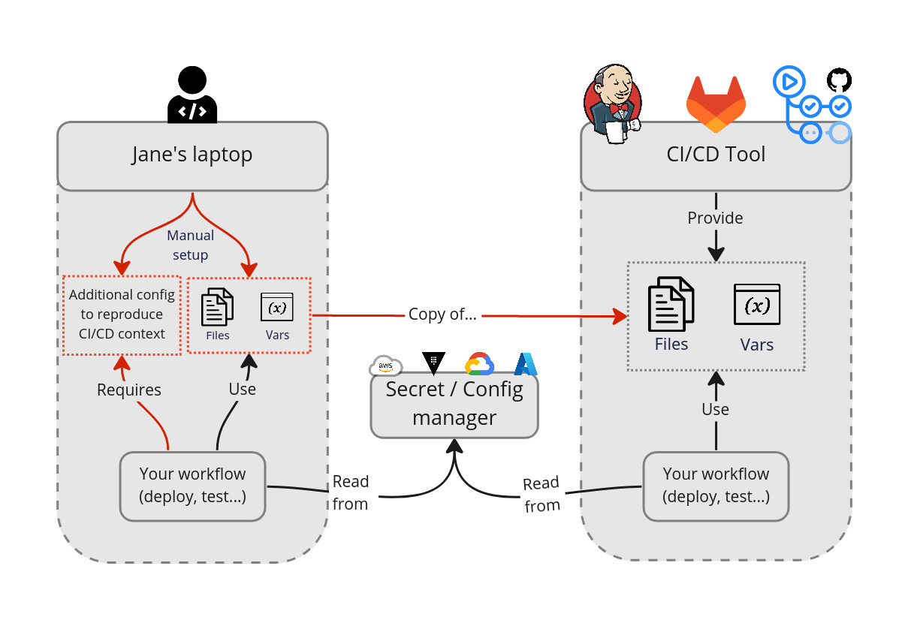

# Novops

Platform agnostic secret and config manager for DevOps, CI and development environments.

  - [Why Novops?](#why-novops)
  - [Features](#features)
  - [Getting started](#getting-started)
  - [Documentation](#documentation)
  - [Contributing](#contributing)
  - [License](#license)

## Why Novops?

Consider a typical Infra as Code project:
- Terraform managing Cloud infrastructure and virtual machines
- Ansible configuring virtual machines and deploying applications
- GitLab for CI and GitOps implementation
- Multiple environments: dev, preprod, prod...

Maintainer have to manage configurations for:
- Various environment-specific configs for deployment tools (Terraform workspace, Ansible inventory, etc.)
- Various secrets used both during deployment (AWS creds, Hashicorp Vault tokens, etc.) and set-up secret configs for apps (passwords, tokens, etc.)



Most of the time managed as files, environment variables and/or through a config/secret manager (Hashicorp Vault, AWS Secret Manager...):
- Maintainers need a local copy of each secrets (such as local as git-ignored _.env_, _.token_, etc. files **per environment**)
- The same configs/secrets are duplicated on CI tools for each environments
- Using a secret manager like Hashicorp Vault reduces load, but you often needs to call this external dependency in multiple places (current shell, Terraform provider, Ansible lookup...)

Your team often ends-up with wieh either or both:
- Frustration to setup and maintain local development environment
- Depending solely on CI only to test IaC code change, with long and painful feedback loops (as it's too complex to setup the same environment locally)


Novops help reducing drift and ease reproducibility between local and CI context, and between environments by centralazing in a single config all secrets/configs your tools depend-on.

### Features

- Securely load secrets and configs as files or environment variables
- Integrate with various secret providers: Hashicorp Vault, BitWarden...
  - _More to come! [Wanna contribute?](./CONTRIBUTING.md)_
- Integrate seamlessly with any shell and most CI/CD tools: GitLab, Github, Jenkins...
- Reduce drift between local dev context and CI/CD
- Manage multi-environment (dev, preprod, prod...)

## Getting started

Create a `.novops.yml` file:

```yaml
name: myapp

environments:
  dev:
    variables:
      # Plain string
      - name: APP_URL
        value: "http://127.0.0.1:8080"

      # Retrieve secret from Hashicorp Vault using KV v2 Secret Engine
      - name: APP_PASSWORD
        value:
          hvault_kv2:
            mount: "secret"
            path: "myapp/dev/creds"
            entry: "password"

    files: 
      # Retrieve secret from BitWarden and save it to file
      # File path will be exposed via env var APP_TOKEN
      - name: APP_TOKEN
        content: 
          bitwarden:
            entry: "Dev Secret Token"
            field: notes
```

Novops will generate a _secure_ sourceable file containing all your variables and references to files such as:

```sh
$ cat /run/user/1000/novops/example-app/local/vars
# export APP_URL='127.0.0.1:8080'
# export APP_PASSWORD='s3cret'
# export APP_TOKEN='/run/user/1000/novops/myapp/dev/file_APP_TOKEN'
```

Load Novops config:
- **We strongly recommend using [`direnv`](https://direnv.net/)** for seamless shell integration
  ```sh
  # Load novops and create a symlink .envrc -> secure sourceable file
  # direnv will source automatically in current shell
  novops load -e dev -s .envrc
  # ...
  # direnv: loading ~/myproject/.envrc  
  ```
- Alternatively you can source manually:
  ```sh
  novops load -e dev -s .myenvs && source .myenvs
  ```

Your shell session is now loaded!

```sh
env | grep APP_
# APP_URL=127.0.0.1:8080
# APP_PASSWORD=s3cret
# APP_TOKEN=/run/user/1000/novops/myapp/dev/file_APP_TOKEN
```

## Documentation

- [Security - how safe is Novops?](./docs/security.md)
- [Usage with DevOps tools: Docker, GitLab CI, Nix...](./docs/usage.md)
- [Available modules: Hashivault, BitWarden, AWS...](./docs/modules.md)
- [`.novops.yml` configuration reference](./docs/schema.json)
- [Internal architecture: Inputs, Outputs and resolving](./docs/architecture.md)
- [Contribution guide](./docs/contributing.md)

## Contributing

We welcome contributions: bug reports/fixes, modules, proposals... :)

See [contribution guide](./docs/contributing.md)

## License

