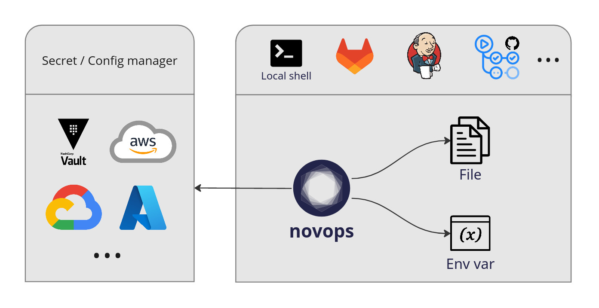

# Novops

Platform agnostic secret and config manager for DevOps, CI and development environments.

- [Novops](#novops)
  - [Features](#features)
  - [Install](#install)
  - [Getting started](#getting-started)
  - [Documentation](#documentation)
    - [Security - how safe is Novops?](#security---how-safe-is-novops)
    - [Why is Novops + direnv strongly advised?](#why-is-novops--direnv-strongly-advised)
    - [Usage with DevOps tools: Docker, GitLab CI, Nix...](#usage-with-devops-tools-docker-gitlab-ci-nix)
    - [Available modules: Hashivault, BitWarden, AWS...](#available-modules-hashivault-bitwarden-aws)
    - [`.novops.yml` configuration reference](#novopsyml-configuration-reference)
    - [Internal architecture: Inputs, Outputs and resolving](#internal-architecture-inputs-outputs-and-resolving)
    - [Development guide](#development-guide)
    - [Contribution guide](#contribution-guide)
  - [Contributing](#contributing)

## Features



- Securely load secrets and configs as files or environment variables
- Reduce drift between local dev context and CI/CD
- Integrate with various secret providers: Hashicorp Vault, BitWarden...
- Easily integrated within most shells and CI systems: Gitlab, GitHub, Jenkins...
- Manage multi-environment (dev, preprod, prod...)
- Quick and easy installation using static binary

## Install


```
curl -L "https://github.com/novadiscovery/novops/releases/download/v0.1.20/x86_64-unknown-linux-musl.zip" -o "novops.zip"
unzip novops.zip
sudo mv novops/novops /usr/local/bin/novops
```

## Getting started

Create a `.novops.yml` file:

```yaml
name: myapp

environments:
  dev:
    variables:
      # Plain string
      - name: APP_URL
        value: "http://127.0.0.1:8080"

      # Retrieve secret from Hashicorp Vault using KV v2 Secret Engine
      - name: APP_PASSWORD
        value:
          hvault_kv2:
            mount: "secret"
            path: "myapp/dev/creds"
            entry: "password"

    files: 
      # Retrieve secret from BitWarden and save it to file
      # File path will be exposed via env var APP_TOKEN
      - name: APP_TOKEN
        content: 
          bitwarden:
            entry: "Dev Secret Token"
            field: notes
```

Novops will generate a _secure_ sourceable file containing all your variables and references to files such as:

```sh
$ cat /run/user/1000/novops/example-app/local/vars
# export APP_URL='127.0.0.1:8080'
# export APP_PASSWORD='s3cret'
# export APP_TOKEN='/run/user/1000/novops/myapp/dev/file_APP_TOKEN'
```

Load Novops config:
- **We strongly recommend using [`direnv`](https://direnv.net/)** for seamless shell integration
  ```sh
  # Load novops and create a symlink .envrc -> secure sourceable file
  # direnv will source automatically in current shell
  novops load -e dev -s .envrc
  # ...
  # direnv: loading ~/myproject/.envrc  
  ```
  See [Why is Novops + direnv strongly advised?](./docs/novops-direnv.md)
- Alternatively you can source manually:
  ```sh
  novops load -e dev -s .myenvs && source .myenvs
  ```

Your shell session is now loaded!

```sh
env | grep APP_
# APP_URL=127.0.0.1:8080
# APP_PASSWORD=s3cret
# APP_TOKEN=/run/user/1000/novops/myapp/dev/file_APP_TOKEN
```

## Documentation

### [Security - how safe is Novops?](./docs/security.md)
### [Why is Novops + direnv strongly advised?](./docs/novops-direnv.md)
### [Usage with DevOps tools: Docker, GitLab CI, Nix...](./docs/usage.md)
### [Available modules: Hashivault, BitWarden, AWS...](./docs/modules.md)
### [`.novops.yml` configuration reference](./docs/schema.json)
### [Internal architecture: Inputs, Outputs and resolving](./docs/architecture.md)
### [Development guide](./docs/development.md)
### [Contribution guide](./CONTRIBUTING.md)

## Contributing

We welcome contributions: bug reports/fixes, modules, proposals... :)

See [contribution guide](./CONTRIBUTING.md)
