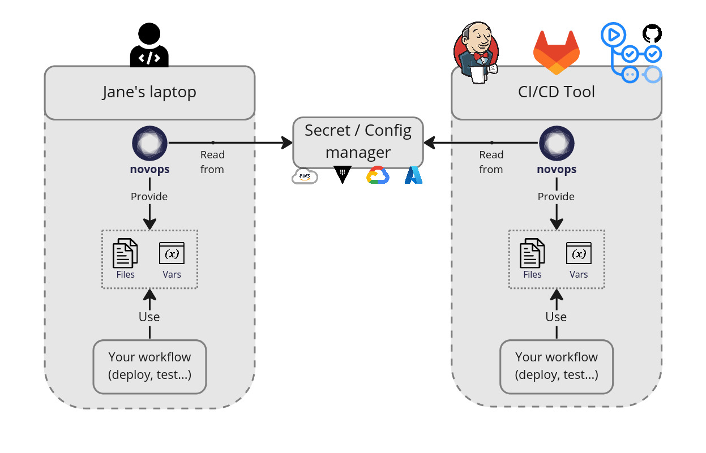

# Why Novops?

Consider a typical Infra as Code project:
- Deployment tool (Terraform, Ansible...) managing Cloud infrastructure / machines configurations
- CI/CD (GitLab, Jenkins...) with GitOps implementation for multiple environments: dev, staging, prod...

Typically, teams must manage configurations in several places:
- A Secret Manager (Hashicorp Vault, AWS Secret Manager...) holding most secrets
- Internal CI/CD configs and secrets (creds for secret manager, per-environment configs, etc.) provided as files or environment variables 

Your team often ends-up with situations like:
- Its hard - or even impossible - to reproduce what happens on CI/CD for debugging and development purposes
- Making things work requires a bunch of (secret) files and environment variables copied from CI/CD config
- Additional setup is required to reproduce CI/CD context (built-in variables, etc.)

Your team ends-up not testing locally altogether - waiting ages for CI/CD workflow to complete after a comme change - or must keep boiler-plate config up-to-date, risking consequent drift as a result. 

Novops allow your team to manage secrets & configs from a single Git-versioned file. Peproducing CI/CD environment locally becomes easy and secure:
- Files and environment variables are loaded from the same source of truth
- Secrets are stored securely and can be cleaned-up easily
- It's then easy to reproduce the same context locally and on CI/CD
